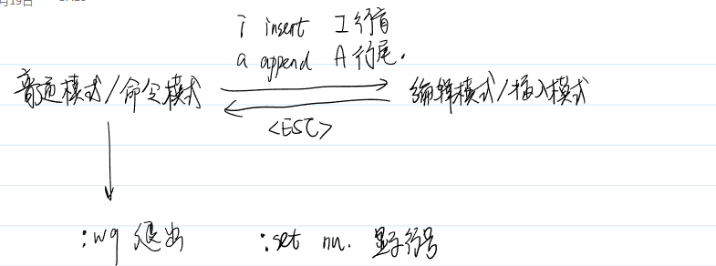

# vim文本编辑器

# Vim简介

练习手册：vimtutor 

## vim模式

分为三种：普通（命令）模式、编辑模式和视觉模式。



| a | 从光标后面开始添加文本（表示新增 append） |
| --- | --- |
| A | 从光标所在行的末尾开始添加文本 |
| i | 从光标前面开始插入文本（表示插入 insert） |
| I | 从光标所在行的开始处插入文本 |

## vim内采用的命令操作

### 删除与修改

| x | 删除光标处的字符 |
| --- | --- |
| dd | 删除光标所在的整行（重要） |
| [n]dd/d[n]d | 删除光标所在行以及下面的n-1行（删除n行） |
| D或d$ | 删除光标到行尾的文本，常用语删除注释语句 (等价于d$)（重要） |
| d^ | 删除光标到行首的文本 |
| dw | 删除一个字（从下一个单词开始）（重要） |
| d3w | 删除三个字 |
| yy | 复制光标所在的整行 |
| [n]yy | 从光标开始往下复制n行，[n]表示一个整数 |
| p | 将复制后的文本粘贴到光标处（重要） |
| u | 撤销上次操作（重要） |
| :x,yd | 删除x到y行（重要） |
| dt) | 删除到）（）可以换其他的）（重要） |

### 光标移动

| ^ | 光标移动到行首 |
| --- | --- |
| $ | 光标移动到行尾 |
| ctrl+d | 向下翻半页(down) |
| ctrl+f | 向下翻一页(forward) |
| ctrl+u | 向上翻半页(up) |
| ctrl+b | 向上翻一页(backward) |
| gg | 光标定位到文档头（重点） |
| G | 光标定位到文档尾（重点） |
| H | 光标定位到当前页首（head） |
| L | 光标定位到当前页的最后一行的行首（lastline） |
| w | 光标往后移一个字 （word） |
| b | 光标往前移一个字 （block） |
| [n]-（[]说明数字） | 光标向后移动n行,[n]表示一个整数 10+（重点） |
| [n]+ | 光标向前移动n行,[n]表示一个整数 10-（重点） |
| [n]G | 光标定位到第n行行首, [n]表示一个整数 20G（重点） |
| :[n] | 光标定位到第n行行首, [n]表示一个整数 :20（重点） |

### 查找与替换

```bash
/[str] 查找字符串str，[str]表示要查找的字符串
回车后会加亮显示所有找到的字符串，接着输入n移动到下一个找到的字符串，输入N移动到上一个找到
的字符串
:s/[src]/[dst]/[i忽略大小写][g处理本行中所有的匹配项] 用dst替换字符串src
:s/hello/world/ig 替换一行
:x,y s/[src]/[dst]/ig（x-y行中找）
:3,6 s/hello/world 将3-6行里面，找到第一个hello替换为world
:%s/[src]/[dst]/g 将文档中所有src的字符串替换为dst字符串
:%s/^ //g 将文档每一行的行首的空格去掉
:%s/^\t//g 将文档每一行的行首的制表符去掉
提问：如何使用替换命令注释所有块内代码？
提问：如何使用替换命令转换实现制表符和4个空格之间的转换？
```

### 可视模式

```bash
v 进入可视模式
ctrl+v 竖向选择模式
```

- 进入可视模式后，可以使用光标移动指令来移动光标，并且会选中区域
- 批量注释代码，输入步骤如下：

```bash
首先按ctrl+v，竖选选中要注释的行
输入I（注意是大写的I，表示在选中区域的前方），然后输入//
再按下ESC，就会看到选中的行被注释了
```

### 文档保存及退出

```bash
:q 在未修改文档的情况下退出
:q! 放弃文档的修改，强行退出
:w 文档存盘
:wq 文档存盘退出
:x 和:wq一样，不过不推荐使用，容易和:X混淆
```

### 其他操作

```bash
:help 查看该命令的帮助提示（不常用，当不小心按F1时，通过:q进行退出）
:%!xxd 十六进制模式
:%!xxd –r 返回文本模式，注意中间有一个空格
```

- 如果在编辑过程中不小心按了CTRL+s，vim会处于僵死状态，按CTRL+q可以恢复
- 光标定位

```bash
执行 vim +3 main.c 表示定位到main.c的第3行
执行 vim +/printf main.c 表示定位到第一个printf处
```

- 多窗口

```bash
:new 2.c 再打开一个vim，是横向的
:vnew 2.c 再打开一个vim，是纵向的
也可以通过:split，vsplit，sp，vsp
ctrl+w,w（连续按两次w） 两个窗口之间进行切换的方式
```

- 多标签

```bash
:tabnew 文件名 再打开一个vim标签
gt 切换到下个标签
gT 切换到上个标签
```

- 代码格式对齐使用

```bash
使用 = 可以进行代码对齐
gg=G 对齐全文件
gg=10gg 对齐第一行到第十行
在可视模式选中代码块，再按下=也能对齐代码块
```

- 代码注释

```bash
ctrl+v进行列优先可视模式
选中注释区域
shift+i
//
ESC
```

## 文件内容对比 vimdiff

vimdiff file1 file2