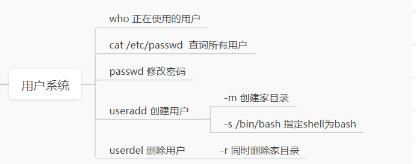

# shell命令

# 用户系统

ubantu不显示ip

```bash
sudo dhclient ens33
sudo ifconfig ens33
```



## 查看当前栈用户

```bash
who
```


用户分为：特权用户和普通用户。可以根据（比如who前面的符号）是$就是普通用户，#就是特权用户

## 修改特权用户密码

```bash
sudo passwd root
```


修改特权用户密码需要权限，这就需要使用sudo命令


## 切换用户

```bash
su root
```


su命令和exit/ctrl+D的区别在于exit会将用户推出栈（相当于推出用户），su不会将用户推出

## 查询已经存在的用户

```bash
cat /etc/passwd
```


解释其中意思：以：分割

用户名：密码：uid：gid：用户名，，，：家目录：shell版本（csh/bash/zsh/sh）

## 创建新用户

```bash
useradd -create username
```


!注意：


问题1：没有家目录：通过 ls /home/test2查看该路径文件下的内容，直接报错，表示不存在该文件夹。

问题2：shell的版本是sh

在创建的时候需要在后面添加参数

```bash
sudo useradd -create test2 -m -s /bin/bash #创建的shell版本是bash，-m表示创建家目录
```

## 删除用户

```bash
sudo userdel test2
sudo userdel -r test2 # -r 表示删除和家目录一起删除
```

## man命令

需要不会使用的命令可以通过man命令来看着该命令的使用手册

# 文件系统

## 查看当前工作目录 ： pwd


## 查看当前目录下所有文件： ls


无论哪个目录下使用ls,都会发现结果必有两个问目录文件，依次是.和..

- . 代表的是当前目录，.. 代表的是上级目录
- 在ls后面可以添加路径名

ls -a 可以看到隐藏文件


ls -l 查看文件信息（ls -lh可以自动将文件大小按照B、K、M、G显示）


第一列表示这文件的**类型**：d(目录文件)、-（普通文件）。后续的九个字母代表的是**文件静态权限**，依次代表这拥有者的读写执行、拥有者者的读写执行、其他用户的读写执行（r : 可读，w：可写，x：执行）后续数字表示：**硬链接。**第一个lazysheep：**文件拥有者。文件大小（单位B）。**第二个lazysheep：**文件拥有组**。**修改时间。文件名**

## 硬链接

在VFS的树的不同位置，对应真是磁盘的同一片位置

引用计数：记录某个数据被指向的次数。

## 拷贝： cp source destination


destingnation:把source的内容拷贝到destination

**destination是一个普通的文件**

1. destination本身已经存在，被覆盖
2. destination本身不存在，新建

**destination是一个目录文件**

在目录文件下创建一个source文件

cp -i source destination 

-i 会增加覆盖提示

可以通过tree 查看文件的结构（需要安装 sudo apt install tree）


## 剪切 mv source destination

1. 如果destination是一个普通文件（重命名）
2. 如果destination是一个目录文件（移动）

## 当cp和mv一个目录


## 文件权限的影响（修改权限）：

文字设定法：

chmod [who] [+ | - | =] [mode] 文件名


数字设定法：

chmod 644 file1  (八进制)


删除或修改file1文件需要dir1的写权限，因为需要修改dir1的目录项文件


## 删除文件

rm 文件名


添加-r 命名可以删除整个文件，（禁止在root/sudo下使用，很容易出现错误）

## find文件：find 起点 查询条件


### 按名字： find . -name file1


模糊查找

可用通过通配符wlidcard

- * ：取代任何字符串（包括空串）重点


- ？：取代任意一个字符


- [ ] ：取代集合内任意一个字符


### 按-user/uid/group/gid

### 按权限查询： -perm


### 按文件大小查询：-size


后面不写c，默认是b（512B）

查找范围：+、-


### 按文件类型查找：-type


### 查找空文件：-empty


### 按照文件时间查找：


### 组合操作： -a -o !


## 磁盘相关命令

查看文件系统的磁盘信息： df


显示每个文件和目录的磁盘使用空间： du


-d 后面接深度

## 查看文件具体类型：file


## 重定向


分开重定向


追加重定向


输出重定向


## 创建空文件

1. touch 空文件 （touch也存在文件，更新修改时间）
2. echo -n >file1
3. cat > file  再按CTR+D 输入EoF
4. vi file  再依次按<ESC>、：、w、q、<Enter>

## 查看文件内容

cat:


more  or less:两个用法差不多


查看文件尾部：tail

tail - n 30 /var/log/syslog

表示查看该文件的后三十行

查看文件头部：head

head - n 30 /var/log/syslog

表示查看该文件的前三十行

## 统计字数： wc 文件名


## 编码转换：iconv  -f source -t destination


-f from -t to


将1.txt文件的gb2312编码转换成utf-8并且保存到2.txt文件中

## 文件内容检索（重点）：grep  -nE  “ .*” file1

### 正则表达式：

普通字符：a~z、A~Z、0~9

连接：ab

. 表示任意字符

运算符：? 、 *  、+  、[]  、\<  、\> 、 | 、（）

基本单位？ 表示单位出现1次或0次

基本单位*   表示单位出现0或任意次

基本单位+  表示出现1或任意次

以^开头基本单位  比如 ^how 行首是以how开头

基本单位$  比如 how$ 行首是以how结尾

[集合]基本单位

\<单词   开头 相当于 ^基本单位

单词\>   结尾  基本单位$

（regax）把regax整体作为一个基本单位

## 如何知道FILE结构体的内部设计


## 起别名：alias


默认的别名

起别名，整个是暂时的，永久的暂时没教

alias a=’echo hello’

## 命令组合

1、分号 ； cmd1;cmd2 依次执行


2、利用管道机制：cmd1 | cmd2将cmd1命令的输出 输入cmd2

sort file1 将file1文件内容排序

uniq file1删除连续的重复的（没有连续的不会删除）

3、xargs


file2里面的文件内容是:

dir1

dir2

dir3

xargs通常是配合管道使用的

查询一个文件下c程序的主函数位置


xargs的弱化版：cmd1 `cmd2` (ESC下面的`)

先执行cmd2，把cmd2的结果作为cmd1的参数


## tar 打包和压缩


c:创建 r:追加 x:释放

v:显示打包进程 f:指定包的名字 z:gzip算法压缩 j:bzip2算法压缩


## 远程拷贝：scp source destination

描述远端位置：用户名@ip地址：路径


## 身份验证

第一种：用户名+密码

第二种：密钥（分为私钥和公钥）

生成密钥：ssh-keygen

生成的密钥在.ssh文件夹下

cd .ssh/


[编译工具链](https://www.notion.so/1873278264a18082ab22f9160107fca0?pvs=21)